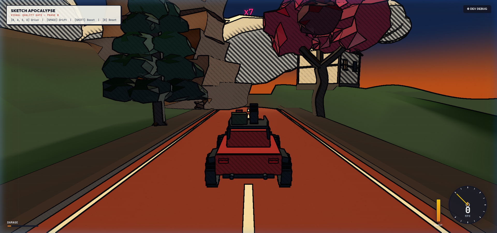

# SKETCH APOCALYPSE

> **Stylized Open-World Driving Game — Clean Foundation Architecture**



## Overview

**Sketch Apocalypse** is a professional stylized 3D open-world driving game built with React, TypeScript, Three.js, and custom NPR (Non-Photorealistic Rendering) GLSL shaders. Inspired by Franco-Belgian comic aesthetic (Moebius, Tintin) and Forza Horizon-style driving dynamics, this project establishes a clean, modular visual and technical foundation.

---

## Key Features

- **NPR Graphic Novel Shaders**:
  - **3-Band Quantized Toon Shading**: Calibrated lighting ramps with comic rim accents and ambient fill.
  - **Procedural Shadow Crosshatching**: Stylized ink hatching in core shadow regions.
  - **Screen-Space Sobel Ink Pass**: Deep indigo (`#121626`) edge detection on silhouettes and surface creases.
  - **Notebook Parchment Layer**: Integrated warm paper texture with subtle organic grain and ruled margin lines.
- **Hero 3D Assets (No Primitives)**:
  - **Survival 4x4 Buggy**: Angular body chassis, welded roll cage, roof rack carrying spare tire and survival crates, bull bar, dual exhausts, knobby tires, and double-wishbone suspension linkages.
  - **Sculpted Pine Tree**: Organic tapered timber trunk with 5 ascending tiers of sculpted conifer foliage masses.
  - **Sculpted Broadleaf Tree**: Winding trunk with scaffold boughs and a magenta flowering canopy.
  - **Stratified Rock Cliff & Boulders**: Stacked sedimentary rock shelves, horizontal fault planes, and faceted boulders.
  - **Alpine Cottage Building**: Pitched gabled roof, timber beams, illuminated windows, and chimney stack.
  - **3D Crowned Road**: Cambered asphalt surface, raised stone curbs, gravel shoulders, and painted dashed markings.
  - **3D Sculpted Terrain**: Continuous rolling landscape with real-time height sampling.
- **Arcade Vehicle Physics**:
  - 4-wheel independent raycast suspension with physical spring compression/rebound, chassis roll and pitch, steering articulation, and drift mechanics.
- **Instrument HUD & Telemetry**:
  - Speedometer dial with dynamic needle, digital MPH, gear indicator, boost gauge, damage meter, combo multiplier, and toggleable developer debug telemetry.

---

## Controls

| Key | Action |
| :--- | :--- |
| **W / Up Arrow** | Throttle / Accelerate |
| **S / Down Arrow** | Brake / Reverse |
| **A / Left Arrow** | Steer Left |
| **D / Right Arrow** | Steer Right |
| **Space** | Handbrake / Drift |
| **Left Shift** | Nitro Boost |
| **R** | Reset Vehicle Pose |

---

## Project Structure

```text
src/
├── app/
│   ├── App.tsx          # Root React layout & canvas lifecycle
│   ├── index.css        # CSS design system & notebook overlay styling
│   └── main.tsx         # Application entry point
├── assets/
│   ├── models/          # High-fidelity 3D procedural models
│   │   ├── BuildingModel.ts
│   │   ├── BroadleafTreeModel.ts
│   │   ├── CliffRockModel.ts
│   │   ├── PineTreeModel.ts
│   │   ├── RoadSegmentModel.ts
│   │   ├── SurvivalVehicleModel.ts
│   │   └── TerrainSceneModel.ts
│   └── registry/
│       └── AssetRegistry.ts  # Placement metadata & clearance rules
├── debug/
│   └── DebugPanel.tsx   # Real-time telemetry (FPS, triangles, wheel contacts)
├── game/
│   ├── camera/          # Third-person follow camera with lookahead
│   ├── core/            # GameEngine loop & renderer configuration
│   ├── input/           # InputManager for keyboard controls
│   ├── physics/         # ArcadeRaycastPhysics & suspension simulation
│   └── world/           # VisualTestScene composition
├── rendering/
│   ├── atmosphere/      # Drifting leaf particle effects
│   ├── lighting/        # Stylized directional sun, dusk sky, cartoon clouds
│   ├── materials/       # ToonMaterial GLSL shader & TextureFactory
│   └── outlines/        # ScreenSpaceOutlinePass Sobel ink edge detector
└── ui/
    ├── GameOverlay.tsx   # Top score multiplier & damage bar HUD
    └── SpeedometerHUD.tsx # Analog dial & digital speedometer cluster
```

---

## Setup & Running Locally

1. **Install Dependencies**:
   ```bash
   npm install
   ```

2. **Start Dev Server**:
   ```bash
   npm run dev
   ```
   Open `http://localhost:5173/` in your browser.

3. **Production Build**:
   ```bash
   npm run build
   ```

---

## Development Roadmap

- [x] **Phase A — Clean Architecture & Project Setup**: React, Vite, TypeScript, Three.js foundation.
- [x] **Phase B — Visual Quality Gate**:
  - [x] Hero Survival 4x4 Buggy model with articulated suspension.
  - [x] Sculpted Pine & Broadleaf flowering tree assets.
  - [x] Stratified Geological Cliff & faceted boulders.
  - [x] Architectural Alpine Cottage with glowing windows.
  - [x] 3D Crowned Road segment with curbs and line markings.
  - [x] Custom NPR ToonMaterial shader with crosshatching.
  - [x] Screen-Space Sobel ink outline pass in deep indigo (`#121626`).
  - [x] Notebook paper background overlay.
  - [x] Arcade raycast vehicle physics with 4-wheel contact telemetry.
  - [x] Speedometer HUD & Developer Debug panel.
- [ ] **Phase C — Playable Vehicle Sandbox & World Expansion**: Multi-biome streaming & procedural placement.
- [ ] **Future Phase — Zombie Survival Mechanics**: Spawning, hordes, and survival inventory.

---

## Verification & Developer Telemetry

Press **F1** or click the **⚙ DEV DEBUG** button in the top-right corner to toggle real-time developer telemetry:
- Real-time FPS, triangle count, and draw call telemetry.
- Dynamic vehicle speed, world coordinates, and 4-wheel suspension contact indicators.
- One-click toggle for the Screen-Space Sobel Ink Outline pass.

---

## License

ISC License. Built for Sketch Apocalypse Foundation Phase.
